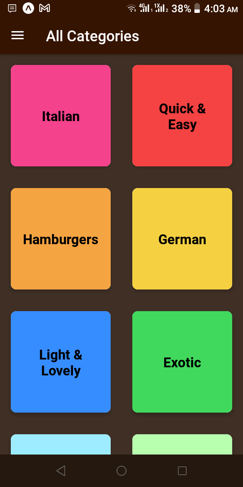
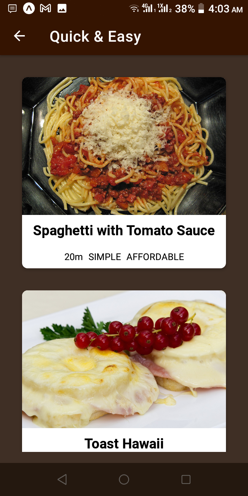
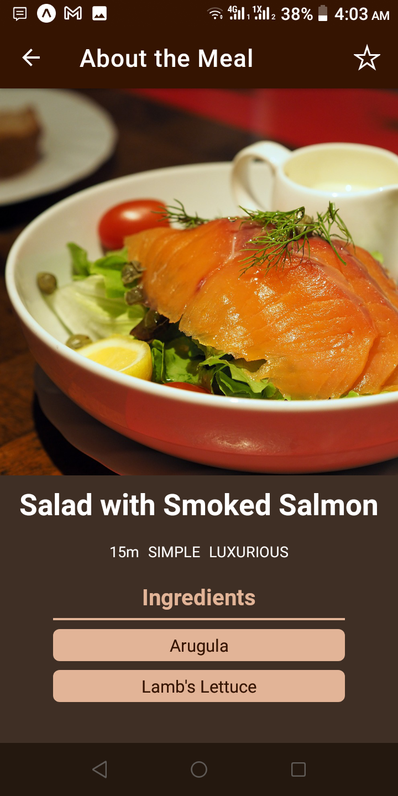
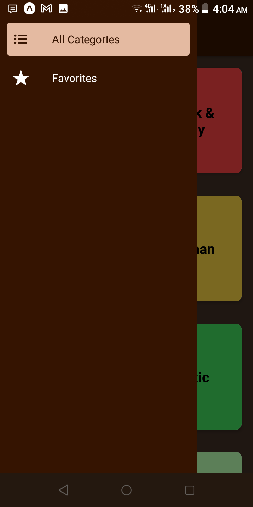
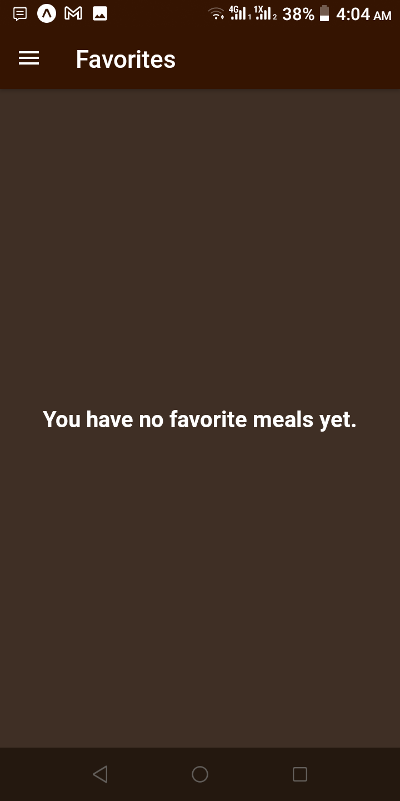
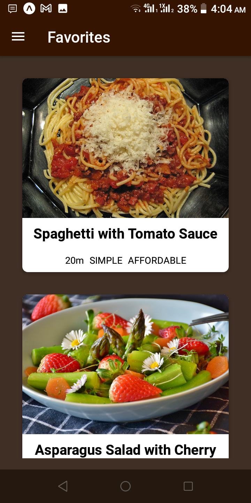

# Recipes App (Using React-Native)

A sample recipes app built using react-native

## Screenshots

<p align="left">
    
    
    
</p>
<p align="left">
    
    
    
</p>

## Things Learned

1. App navigation.
2. How to add an app drawer.
3. How to use react context in react-native.
4. How to use redux toolkit in react-native.

## Installed Packages

```sh
yarn add @react-navigation/native

npx expo install react-native-screens react-native-safe-area-context

yarn add @react-navigation/native-stack

yarn add @react-navigation/drawer

yarn add react-native-gesture-handler react-native-reanimated

yarn add @reduxjs/toolkit react-redux # if redux toolkit is needed
```

## Command-lines used

```sh
yarn expo start -c # to start development after cleaning cache
```
